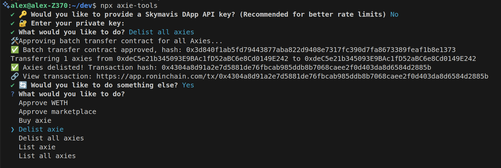
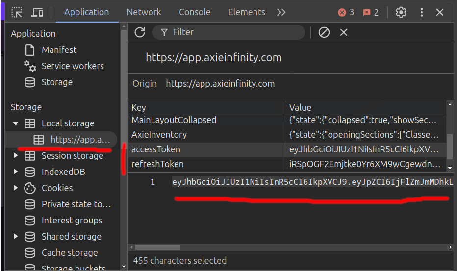

# Axie tools

TypeScript library and CLI tool for interacting with the Axie Infinity marketplace and NFTs on the Ronin network. Features marketplace operations (create marketplace orders – fixed-price & auction, cancel orders, settle orders), batch transfers, approval utilities, and wallet information.

You only need Node.js. Install it from [Node.js official download page](https://nodejs.org/en/download/prebuilt-binaries/)

## Installation & Usage

### Option 1: Install globally

```shell
npm install -g axie-tools
axie-tools
```

### Option 2: Using axie tools library in your Node.js projects

Install as a dependency in your project:

```shell
npm install axie-tools ethers dotenv
```

Create a .env file with the following values:

```shell
# Get from Ronin wallet: Manage wallet > Show private key
PRIVATE_KEY="<your private key, copy from ronin wallet: manage wallet > show private key>"
# Get from app.axie: Browser > Developer Tools > Application > Local storage > https://app.axieinfinity.com > accessToken
MARKETPLACE_ACCESS_TOKEN="<your marketplace access token, log in to the marketplace and copy from the developer console>"
# Required - SkyMavis API key (AxieInfinity API has Cloudflare protection and won't work without complex workarounds)
SKYMAVIS_API_KEY="<your skymavis project key, get from https://developers.roninchain.com/console/applications/"
```

Example usage:

- Settle order (buy axie): [complete example code](https://github.com/alexx855/axie-tools/tree/main/examples/settle-order.js)
- Create order (list axie for sale): [complete example code](https://github.com/alexx855/axie-tools/tree/main/examples/create-order.js)
- Create auction (list axie for auction): [complete example code](https://github.com/alexx855/axie-tools/tree/main/examples/create-order-auction.js)
- Cancel order (delist axie): [complete example code](https://github.com/alexx855/axie-tools/tree/main/examples/cancel-order.js)
- Transfer all axies: [complete example code](https://github.com/alexx855/axie-tools/tree/main/examples/transfer-all.js)

### Option 3: Clone and build from source

For local development or testing the latest changes:

```shell
git clone https://github.com/alexx855/axie-tools.git
cd axie-tools
npm install
npm run build
```

> [!TIP]
> Use the npx command to test this tool with an interactive CLI.

```shell
npx axie-tools
```

This will present an interactive menu with the following options:

- Get account info
- Refresh access token
- Approve WETH
- Approve marketplace
- Settle order (buy axie)
- Cancel order (delist axie)
- Cancel all orders (delist all axies)
- Create order (list axie for sale)
- Create auction (list axie for auction)
- Create orders for all axies (list all)
- Transfer axie
- Transfer all axies

The CLI will guide you through the inputs for each action.

> [!TIP]
> You can create an .env (see .env.example) file to avoid entering values every time you use the CLI.



### How to get marketplace access token

> [!NOTE]
> Get your access token by logging into [https://app.axieinfinity.com/](https://app.axieinfinity.com/) and accessing Developer Tools > Application > Local storage > [https://app.axieinfinity.com](https://app.axieinfinity.com) > accessToken



### Considerations

- You need RON tokens to pay for the gas fees of the onchain transactions.
- All scripts use WETH for the marketplace transactions, you need to have WETH in your wallet to settle orders (buy axies).
- Creating orders (listing) is offchain, you will need to approve the marketplace contract to use your axies first, you can do this with the `approveMarketplaceContract` function or manually in the marketplace website the first time you create an order.
- Settling orders (buying) is onchain, you need to have approve WETH allowance, you can do this with the `approveWETH` function or manually in the marketplace website the first time you settle an order.
- Cancelling orders is onchain.
- If you get a "Signer is not maker" error, make sure the access token is correct.

### Contributing

Feel free to open an issue or a pull request if you have any error, questions or suggestions.

### Testing

Run tests with bun. Set the `AXIE_ID` and `PRICE` environment variables and specify a test file. Default timeout is 5000ms; override with `--timeout`. Examples:

```shell
# Create order (list axie for sale)
AXIE_ID=111111 PRICE=0.1 bun test tests/create-order.test.ts --timeout 30000

# Cancel order (delist axie)
AXIE_ID=111111 PRICE=0.1 bun test tests/cancel-order.test.ts --timeout 30000

# Settle order (buy axie)
AXIE_ID=111111 PRICE=0.1 bun test tests/settle-order.test.ts --timeout 30000
```
